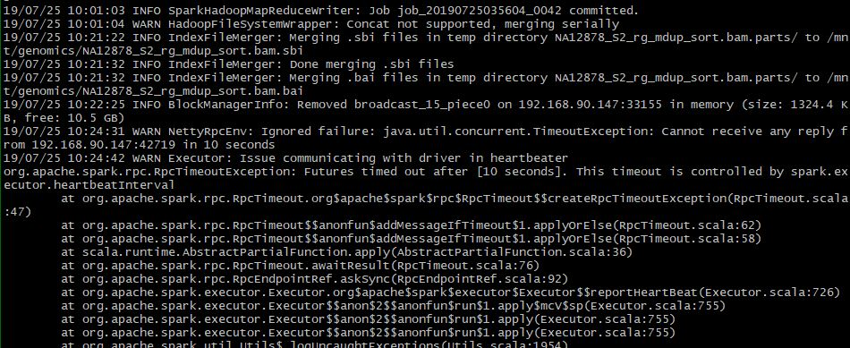

# Run-through

This run-through will show go through the steps of the genomic pipeline (from CBCLs to VCF) using non-DRAGEN tools.

__Informative Links (Need to put somewhere else)__

[Cornell Variant Calling Slides Part 1](https://biohpc.cornell.edu/lab/doc/Variant_workshop_Part1.pdf)

[Cornell Variant Calling Slides Part 2](https://biohpc.cornell.edu/lab/doc/Variant_workshop_Part2.pdf)

### Computer Specs

| | |
|-|-|
| CPU | Intel Xeon E5-2678 v3 @ 2.50 GHz |
| Cores | 24 |
| RAM | 126 GB |
| Memory | 37 TB |

### Tools Used
- bcl2fastq 2.20.0.422
- bwa 0.7.17-1
- samtools 1.9
- picard 2.20.3
- gatk 4.1.2.0

Note: gatk 4.1.2.0 comes with picard 2.19.0. The picard tool that is being used in this run-through is separate from gatk.

### Initial Files

- [__Reference Genome GRCh38.p13__](https://www.ncbi.nlm.nih.gov/assembly/?term=GRCh38)
- __Run Data__
  - Access the [BaseSpace public data sets](https://basespace.illumina.com/datacentral)
  - Search _NovaSeq 6000 SP: TruSeq PCR-Free 450 (2 replicates of NA12878)_
  - Import the run to your account
  - Download via [BaseSpace CLI](https://developer.basespace.illumina.com/docs/content/documentation/cli/cli-overview)
  - The run data should be about 94 GB
  - This data is the human genome sample NA12878, [which has high confidence variants for a human sample. It is used as a benchmark in many genomic research projects.](https://biology.stackexchange.com/questions/57811/why-should-we-use-the-na12878-dataset-for-benchmarking)

### Convert the run data (CBCLs) to FASTQ
`basespace_NA12878` is the directory that contains the run data.

`--no-lane-splitting`
to prevent FASTQ files from being split by lane.

```
bcl2fastq -R basespace_NA12878 -o /mnt/genomics/fastq_files_NA12878 --no-lane-splitting
```

___Time___
`42171.47s user 300.86s system 4458% cpu 15:52.54 total`

***fastq_files_NA12878 Contents***
```
fastq_files_NA12878
├── NA12878-PCRF450-1_S1_R1_001.fastq.gz
├── NA12878-PCRF450-1_S1_R2_001.fastq.gz
├── NA12878-PCRF450-2_S2_R1_001.fastq.gz
├── NA12878-PCRF450-2_S2_R2_001.fastq.gz
├── Reports
├── Stats
├── Undetermined_S0_R1_001.fastq.gz
└── Undetermined_S0_R2_001.fastq.gz
```

Decompress with gzip to get the FASTQ files.
Four decompressed FASTQ files add up to 656 GB.
Meaning 94 GB of CBCLs converted to 656 GB of FASTQs.

### Map/Align FASTQ to BAM

1. Create bwa index files for the reference FASTA file.
```
bwa index -a bwtsw GCF_000001405.39_GRCh38.p13_genomic.fna
```
___Time___
`4208.44s user 26.93s system 99% cpu 1:10:47.24 total`

  Might as well create the reference dictionary file while we are at it as well (used by GATK later).

  ```
  java -jar picard/picard.jar CreateSequenceDictionary R= GCF_000001405.39_GRCh38.p13_genomic.fna O= GCF_000001405.39_GRCh38.p13_genomic.dict
  ```

  ___Time___
  `53.42s user 6.09s system 242% cpu 24.553 total`

  And the fai file as well (also used by GATK)

  ```
  samtools faidx GCF_000001405.39_GRCh38.p13_genomic.fna
  ```

  ___Time___
  `11.41s user 1.60s system 97% cpu 13.317 total`

2. Align sample 1 and sample 2 as pair-ended reads, which will create a SAM file. To save storage space, pipe the output to samtools to end up with a BAM.

  Ran both samples in parallel, half the threads for sample 1 and half the threads for sample 2.

  ___Sample 1___
  ```
  bwa mem -t 24 GCF_000001405.39_GRCh38.p13_genomic.fna fastq_files_NA12878/NA12878-PCRF450-1_S1_R1_001.fastq fastq_files_NA12878/NA12878-PCRF450-1_S1_R2_001.fastq | samtools view -@ 24 -o NA12878_S1.bam -
  ```
  ___Time___

  `bwa mem -t 24 GCF_000001405.39_GRCh38.p13_genomic.fna    870775.86s user 6008.81s system 2314% cpu 10:31:23.95 total`

  `samtools view -@ 24 -o NA12878_S1.bam  23229.54s user 975.26s system 63% cpu 10:31:23.77 total`

  ___Sample 2___
  ```
  bwa mem -t 24 GCF_000001405.39_GRCh38.p13_genomic.fna fastq_files_NA12878/NA12878-PCRF450-2_S2_R1_001.fastq fastq_files_NA12878/NA12878-PCRF450-2_S2_R2_001.fastq | samtools view -@ 24 -o NA12878_S2.bam -
  ```
  ___Time___

  `bwa mem -t 24 GCF_000001405.39_GRCh38.p13_genomic.fna    762165.59s user 4784.47s system 2312% cpu 9:12:51.64 total`

  `samtools view -@ 24 -o NA12878_S2.bam  19139.70s user 810.07s system 60% cpu 9:12:51.48 total`

  Notes: running at ~90 GB of RAM

  NA12878_S1.bam = 99 GB

  NA12878_S2.bam = 80 GB

### Validate the BAM Files

The Picard tool, [ValidateSamFile](https://software.broadinstitute.org/gatk/documentation/tooldocs/4.0.1.1/picard_sam_ValidateSamFile.php) can report errors about a SAM or BAM file. The tool runs in verbose mode, and will exit after finding 100 errors. It's much better to use the SUMMARY mode.

___Sample 1___
```
java -jar picard/picard.jar ValidateSamFile I= NA12878_S1.bam O= validateS1.txt MODE= SUMMARY  
```
___Time___
`4901.64s user 135.30s system 107% cpu 1:18:20.62 total`

___Sample 2___
```
java -jar picard/picard.jar ValidateSamFile I= NA12878_S2.bam O= validateS2.txt MODE= SUMMARY  
```
___Time___
`4017.64s user 106.92s system 106% cpu 1:04:24.77 total`

___validateS1.txt___
```
## HISTOGRAM    java.lang.String
Error Type      Count
ERROR:MISSING_READ_GROUP        1
WARNING:RECORD_MISSING_READ_GROUP       1061942667
```
___validateS2.txt___
```
## HISTOGRAM    java.lang.String
Error Type      Count
ERROR:MISSING_READ_GROUP        1
WARNING:RECORD_MISSING_READ_GROUP       856982169
```
We see that both are missing the Read Group field in the header. We can also see that all records are missing a read group.

The next step is to use Picard AddOrReplaceReadGroups. GATK requires several read group fields and will fail if they are missing.

### Adding Read Groups

Read groups can be added with Picard [AddOrReplaceReadGroups](https://software.broadinstitute.org/gatk/documentation/tooldocs/4.0.0.0/picard_sam_AddOrReplaceReadGroups.php#--SORT_ORDER). I added the necessary read group fields that are required by GATK. The values of things like flowcell barcode, lane numbers, sample barcode, DNA library identifiers should be noted during the experiment. This information can be found in the run data under a file called RunParameters.xml and RunInfo.xml.

ID = H5HVMDRXX.1

PU = H5HVMDRXX.1.NA12878

SM = NA12878

PL = ILLUMINA

LB = NV0038306-LIB

___Sample 1___
```
java -jar picard/picard.jar AddOrReplaceReadGroups I= NA12878_S1.bam O= NA12878_S1_rg.bam RGID= H5HVMDRXX.1 RGPU= H5HVMDRXX.1.NA12878 RGSM= NA12878 RGPL= ILLUMINA RGLB= NV0038306-LIB
```

___Time___
`16382.65s user 219.89s system 105% cpu 4:23:10.43 total`

___Sample 2___
```
java -jar picard/picard.jar AddOrReplaceReadGroups I= NA12878_S2.bam O= NA12878_S2_rg.bam RGID= H5HVMDRXX.2 RGPU= H5HVMDRXX.2.NA12878 RGSM= NA12878 RGPL= ILLUMINA RGLB= NV0038306-LIB
```

___Time___
`13275.14s user 174.81s system 104% cpu 3:34:02.56 total`

NA12878_S1_rg.bam = 101 GB
NA12878_S2_rg.bam = 82 GB

Note:

`bwa mem` has the option of adding read groups while aligning. This is done with the flag `-R`. In retrospect, read groups should be added while aligning. However, if forgotten, it can be added later with Picard AddOrReplaceReadGroups.


### Sorting and Marking Duplicates

Sorting and marking duplicates are done with Picard SortSam + Picard MarkDuplicates. Both these tools are single threaded tools and cannot take advantage of multiple cores. GATK MarkDuplicatesSpark is a multi-threaded implementation of SortSam + MarkDuplicates. GATK MarkDuplicatesSpark will flag duplicates, then automatically sort the records is coordinate order.

I kept running into an error that said "No space left on disk". The problem is that GATK MarkDuplicatesSpark uses the /tmp folder, when it runs out of memory and spills to disk. A fix is to create my own tmp in my working directory, where I had enough space, then set that as my tmp folder.

Now I have an error "There is insufficient memory for the Java RunTime Environment to continue". This happens because I am running both samples in parallel. As both commands run, they slowly eat up the RAM, until there is none left. Then one of them errors out due to insufficient memory, freeing up RAM, and the other continues to run. I also have a feeling that there is a memory leak. Before I ran this, the RAM was sitting at ~60 GB from a previous program. Not sure which one. Ayrton says this is cached because of the filesystem.

Since GATK runs on Java, I am now running the program with a limit of 20 GB on the Java heap. Hopefully this will not overflow the RAM.

Sample 2 ran for ~16 hours, then error'd out. Might be firewall issue?



Sample 1 ran for ~18 hours and stopped with error "Exception in thread "main" java.lang.OutOfMemoryError: Java heap space"

I am now giving up on MarkDuplicatesSpark and going to the alternative, Picard SortSam + MarkDuplicates

___Sample 1___
```
time sudo gatk MarkDuplicatesSpark --java-options "-Xmx20G" -I NA12878_S1_rg.bam -O NA12878_S1_rg_mdup_sort.bam --conf 'spark.executor.cores=12' --conf 'spark.local.dir=/mnt/genomics/tmp'
```
___Sample 2___
```
time sudo gatk MarkDuplicatesSpark --java-options "-Xmx20G" -I NA12878_S2_rg.bam -O NA12878_S2_rg_mdup_sort.bam --conf 'spark.executor.cores=12' --conf 'spark.local.dir=/mnt/genomics/tmp'
```


### Sorting
__Sorting__

___Sample 1___
```  
java -jar picard/picard.jar SortSam I= NA12878_S1_rg.bam O=NA12878_S1_rg_sort.bam Sort_Order=coordinate TMP_DIR= /mnt/genomics/tmp

```
___Time Output___
`24556.04s user 1246.04s system 75% cpu 9:26:20.37 total`

___Sample 2___
```
java -jar picard/picard.jar SortSam I= NA12878_S2_rg.bam O=NA12878_S2_rg_sort.bam Sort_Order=coordinate TMP_DIR= /mnt/genomics/tmp
```

___Time Output___
`20544.86s user 1068.26s system 69% cpu 8:40:53.24 total`

NA12878_S1_rg_sort.bam = 56 GB

NA12878_S2_rg_sort.bam = 46 GB

### Mark Duplicates
